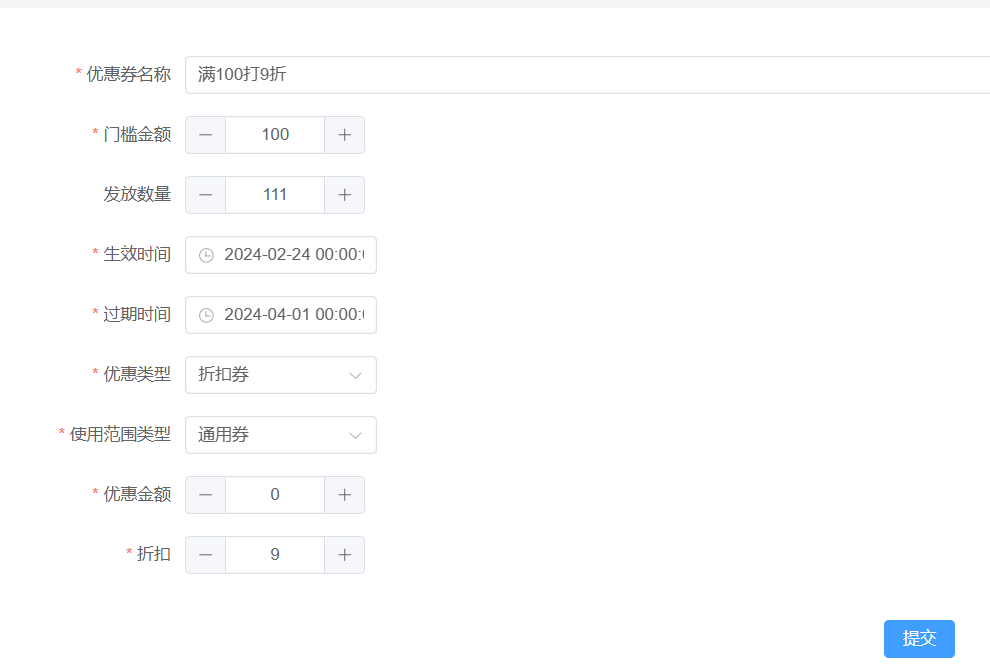
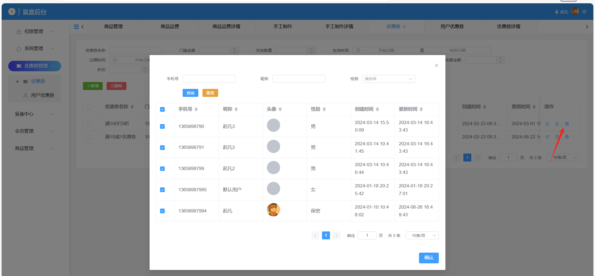

# 优惠券





## 表设计

图1中的表单字段和优惠券表的字段可以一一对应。如果优惠类型是打折，那么`discount`字段就是必填，`amount`字段可为空。如果优惠券类型是满减，那么相反。

```sql
create table coupon
(
    id                varchar(36)    not null
        primary key,
    created_time      datetime(6)    not null,
    edited_time       datetime(6)    not null,
    creator_id        varchar(36)    not null,
    editor_id         varchar(36)    not null,
    name              varchar(255)   not null comment '优惠券名称',
    threshold_amount  decimal(10, 2) not null comment '使用门槛',
    released_quantity int            not null comment '发放数量',
    effective_date    datetime(6)    not null comment '生效时间',
    expiration_date   datetime(6)    not null comment '失效时间',
    coupon_type       varchar(36)    not null comment '优惠类型（打折，满减）',
    scope_type        varchar(36)    not null comment '使用范围（通用，指定商品，类别）',
    amount            decimal(10, 2) null comment '优惠金额',
    discount          decimal(4, 2)  null comment '折扣',
    constraint coupon_pk
        unique (name)
)
    comment '优惠券';
```

用户优惠券关系表，优惠券的来源有很多种，可以使用`receive_type`表示。这边演示的来源方式只有后台赠送一种。如图2所示，在优惠券上点赠送按钮即可批量选择用户赠送优惠券。

```sql
create table coupon_user_rel
(
    id           varchar(36) not null
        primary key,
    created_time datetime(6) not null,
    edited_time  datetime(6) not null,
    creator_id   varchar(36) not null,
    editor_id    varchar(36) not null,
    receive_type varchar(36) not null comment '获得渠道（后台赠送，手动领取）',
    coupon_id    varchar(36) not null comment '优惠券id',
    status       varchar(36) not null comment '使用状态（待使用，已使用，过期）',
    user_id      varchar(36) not null comment '用户id'
)
    comment '用户优惠券';
```

## 优惠券赠送

通过`<user-choose-table></user-choose-table>`组件加上注入`userTableHelper`提供用户表的分页查询，可以很方便的实习用户的d

```vue
<script setup lang="ts">
import UserChooseTable from '@/views/user/components/user-choose-table.vue'
import { Present } from '@element-plus/icons-vue'
import { provide, ref } from 'vue'
import { api } from '@/utils/api-instance'
import { useTableHelper } from '@/components/base/table/table-helper'
import { ElMessage } from 'element-plus'

const userTableHelper = useTableHelper(
  api.userForAdminController.query,
  api.userForAdminController,
  {}
)
provide('userTableHelper', userTableHelper)
const props = defineProps<{ couponId: string }>()
const visible = ref(false)
const handleConfirm = async () => {
  await api.couponForAdminController.gift({
    body: {
      userIds: userTableHelper.getTableSelectedRows().map((row) => row.id),
      id: props.couponId
    }
  })
  ElMessage.success('赠送成功')
  visible.value = false
}
const handleOpen = () => {
  visible.value = true
  userTableHelper.reloadTableData()
}
</script>

<template>
  <el-button type="primary" link size="small" @click="handleOpen">
    <el-icon>
      <present></present>
    </el-icon>
  </el-button>
  <el-dialog append-to-body v-model="visible">
    <user-choose-table></user-choose-table>
    <template #footer>
      <el-button type="primary" @click="handleConfirm">确认</el-button>
    </template>
  </el-dialog>
</template>

<style scoped lang="scss"></style>
```
