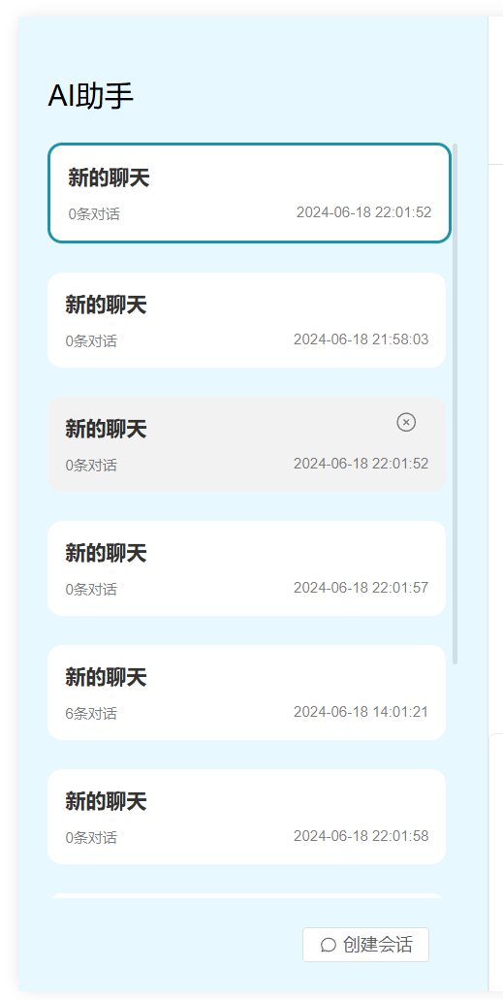
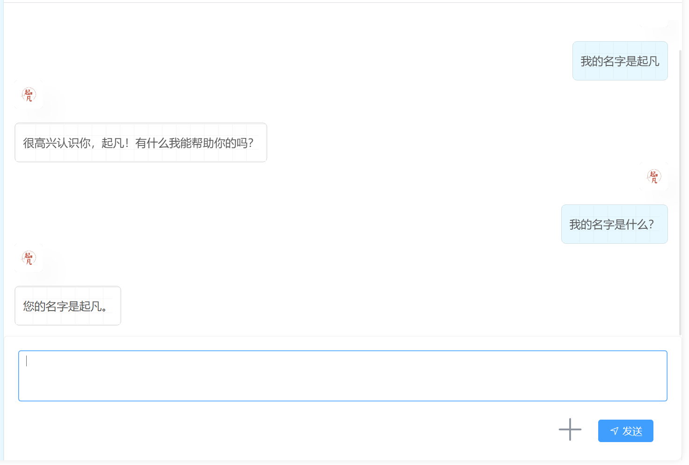

# 前端实现

## 会话列表



for循环遍历会话列表用会话组件显示，并监听点击事件和删除事件。点击时切换到被点击的会话，删除时从会话列表中提出被删除的会话。

```html
<!-- 左侧的会话列表 -->
<div class="session-panel">
  <div class="title">AI助手</div>
  <div class="session-list" v-if="activeSession">
    <!-- 遍历会话列表 -->
    <session-item
      v-for="session in sessionList"
      :key="session.id"
      :active="session.id === activeSession.id"
      :session="session"
      class="session"
      @click="activeSession = session"
      @delete="handleDeleteSession"
    ></session-item>
  </div>
  <div class="button-wrapper">
    <el-button
      style="margin-right: 20px"
      :icon="ChatRound"
      size="small"
      @click="handleSessionCreate"
      >创建会话</el-button
    >
  </div>
</div>
```

会话的创建、删除、加载逻辑。

```ts
const activeSession = ref<AiSession>()
const sessionList = ref<AiSession[]>([])
const handleCreateSession = async (session: AiSessionInput) => {
  const res = await api.aiSessionController.save({ body: session })
  const sessionRes = await api.aiSessionController.findById({ id: res })
  sessionList.value.unshift(sessionRes)
  activeSession.value = sessionList.value[0]
}
// 从会话列表中删除会话
const handleDeleteSession = async (session: AiSession) => {
  await api.aiSessionController.delete({ body: [session.id] })
  const index = sessionList.value.findIndex((value) => {
    return value.id === session.id
  })
  sessionList.value.splice(index, 1)
  if (index == sessionList.value.length) {
    activeSession.value = sessionList.value[index - 1]
  } else {
    activeSession.value = sessionList.value[index]
  }
}
onMounted(async () => {
  // 查询自己的聊天会话
  api.aiSessionController.findByUser().then((res) => {
    // 讲会话添加到列表中
    sessionList.value = res.map((row) => {
      return { ...row, checked: false }
    })
    // 默认选中的聊天会话是第一个
    if (sessionList.value.length > 0) {
      activeSession.value = sessionList.value[0]
    } else {
      handleSessionCreate()
    }
    loading.value = false
  })
})

```

## 消息发送和展示



```html
<!-- 监听发送事件 -->
<message-input @send="handleSendMessage" v-if="activeSession"></message-input>
```

用户发送的逻辑，使用`sse.js`发送消息，并监听sse消息。

```ts
const handleSendMessage = async (message: { text: string; image: string }) => {
  if (!activeSession.value) {
    ElMessage.warning('请创建会话')
    return
  }
  // 图片/语音
  const medias: AiMessage['medias'] = []
  if (message.image) {
    medias.push({ type: 'image', data: message.image })
  }
  // 用户的提问
  const chatMessage = {
    id: new Date().getTime().toString(),
    sessionId: activeSession.value.id,
    medias,
    textContent: message.text,
    type: 'USER'
  } satisfies AiMessage

  // 新建一个ChatGPT回复对象，不能重复使用同一个对象。
  responseMessage.value = {
    id: new Date().getTime().toString(),
    type: 'ASSISTANT',
    textContent: '',
    sessionId: activeSession.value.id
  }
  const evtSource = new SSE(import.meta.env.VITE_API_PREFIX + '/message/chat', {
    withCredentials: true,
    // 禁用自动启动，需要调用stream()方法才能发起请求
    start: false,
    headers: { 'Content-Type': 'application/json' },
    payload: JSON.stringify(chatMessage),
    method: 'POST'
  })
  evtSource.addEventListener('message', async (event: any) => {
    responseMessage.value.textContent = event.data
    // 非通义千问使用下面的消息拼接逻辑
    // responseMessage.value.textContent += event.data
  })
  // 调用stream，发起请求。
  evtSource.stream()
  // 将两条消息显示在页面中
  activeSession.value.messages.push(...[chatMessage, responseMessage.value])
  await nextTick(() => {
    messageListRef.value?.scrollTo(0, messageListRef.value.scrollHeight)
  })
}
```

遍历会话中的消息并展示

```html
<div ref="messageListRef" class="message-list">
  <!-- 过渡效果 -->
  <transition-group name="list" v-if="activeSession">
    <message-row
      v-for="message in activeSession.messages"
      :key="message.id"
      :message="message"
    ></message-row>
  </transition-group>
</div>
```
