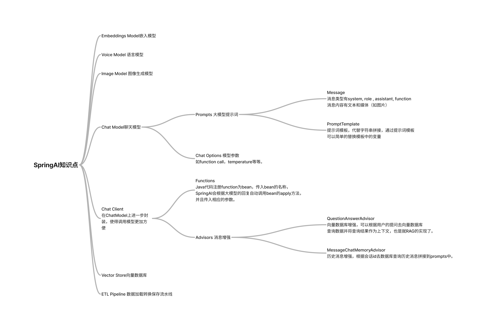

# 项目介绍




SpringAI教程包含Agent（智能体）/SSE流/FunctionCall/Embedding/VectorDatabase/RAG/历史消息/图片理解/等知识点。

[源码地址](https://github.com/qifan777/KnowledgeBaseChatSpringAI)

<BiliBili bvid="BV14y411q7RN" />

## 运行环境

- Java 17
- Node.js 18+
- MySQL 8
- Redis-Stack
- DashScope API KEY（或者其他）

## 运行步骤

### 1.clone代码

```shell
git clone https://github.com/qifan777/KnowledgeBaseChatSpringAI
```

### 2. idea打开项目

### 3. 修改配置文件

修改application.yml中的API-KEY, MySQL, Redis-Stack配置

### 4. 运行项目

前端运行，在front-end目录下

- npm run install
- npm run dev

后端运行

1. 运行ServerApplication.java
2. target/generated-sources/annotations右键mark directory as/generated source root
