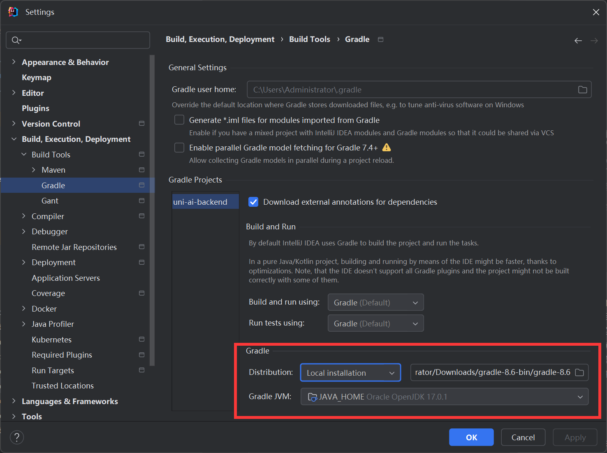

# 源码运行

## 源码获取

```shell
git clone  https://github.com/qifan777/uni-ai
```

## 后端运行

### redis-stack安装

redis-stack在redis的基础上增加了向量数据库的功能

```shell
# todo 配置volume
docker run -d --name redis-stack --restart=always  -v redis-data:/data -p 6379:6379 -p 8001:8001 -e REDIS_ARGS="--requirepass 123456" redis/redis-stack:latest
```

### mysql安装

```shell
docker run -p 3306:3306 -d \
--name mysql8 \
-e MYSQL_ROOT_PASSWORD=123456 \
-e TZ=Asia/Shanghai  \
-e MYSQL_DATABASE=uni_ai \
-v mysql-data:/var/lib/mysql \
--restart=always \
mysql:8.0.26 \
mysqld --character-set-server=utf8mb4 \
--collation-server=utf8mb4_unicode_ci  
```

### jdk17

[国内jdk下载镜像](https://injdk.cn/)

### gradle安装

[gradle安装网址](https://gradle.org/releases/)下载最新版本的gradle，选择`download binary-only`。

安装完配置gradle镜像。在`init.d`文件夹下新建`init.gradle`.

```gradle
allprojects {
    repositories {
        mavenLocal()
        maven { url 'https://maven.aliyun.com/repository/public/' }
        maven { url 'https://maven.aliyun.com/repository/spring/'}
        maven { url 'https://maven.aliyun.com/repository/google/'}
        maven { url 'https://maven.aliyun.com/repository/gradle-plugin/'}
        maven { url 'https://maven.aliyun.com/repository/spring-plugin/'}
        maven { url 'https://maven.aliyun.com/repository/grails-core/'}
        maven { url 'https://maven.aliyun.com/repository/apache-snapshots/'}
        mavenCentral()
    }
}
```

### 导入项目

idea导入uni-ai。里面包含了uni-ai-admin和uni-ai-backend。

首先需要在idea的settings-> build -> build tools -> gradle配置本地的gradle。



::: warning
然后一定要关闭idea重启一下，要不然idea会自动下载gradle，而不是使用本地的下载完且配置好镜像的gradle。
:::

### 配置数据库

运行`uni-ai-backend/scripts/database.sql`下的数据库脚本，导入表结构信息。修改uni-ai-backend/server/src/main/resources/application-dev.yml下的数据库密码和redis密码。

:::info
如果数据库和redis-stack的安装方式是使用我上面提供的docker命令，密码都是123456.
:::

### 配置密钥

[申请密钥](../use/README.md#ai厂商密钥配置)完之后将相关信息填入`uni-ai-backend/server/src/main/resources/application.yml`。

### 运行后端服务

`uni-ai-backend/server/src/main/java/io/qifan/server/ServerApplication.java`

## 前端运行

### node.js安装

由于本项目是用vue3写的，需要较高本吧的node。去官网下载新版的[node.js](https://nodejs.org/en)也可以使用nvm管理不同版本的node。

### 依赖安装

在`uni-ai-admin目录`执行

```shell
npm install
```

### API同步

确保后端已启动，然后执行下面的命令。它可以把后端接口同步到前端，并且会生成每个接口的入参和返回类型的ts类型。

```shell
npm run api-admin
```

### 启动

```shell
npm run dev
```

### 访问

访问 `http://localhost:5177`

账户：11111111111
密码：123456
