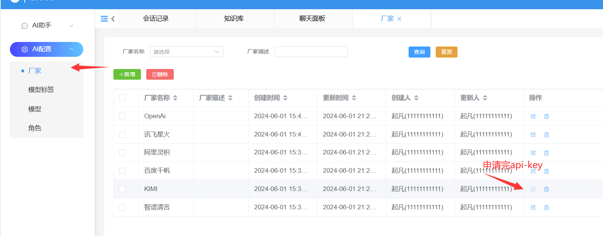

# 使用教程

## AI厂商密钥配置

[kimi api-key申请](https://platform.moonshot.cn/console/api-keys)
[智谱清言 api-key申请](https://maas.aminer.cn/usercenter/apikeys)
[百度千帆 access-key和secret-key](https://console.bce.baidu.com/iam/#/iam/accesslist)
[阿里灵积 api-key](https://dashscope.console.aliyun.com/apiKey)
[讯飞星火 api-key、api-secret、appid](https://console.xfyun.cn/app/myapp)

:::warning
有些ai厂商的api-key需要实名认证后才能使用，请务必确保先实名认证
:::

将申请完的api-key填入对应ai厂商的配置页面即可。

## 知识库

### 新建知识库

菜单路径：Ai助手/知识库

:::warning
知识库的英文名称只能包含字母和_
:::

:::info
目前有四种嵌入模型embedding-2，bge-large-en，text-embedding-v2，text-embedding-3-small分别来自智谱清言、百度千帆、阿里灵积、OpenAi
:::

### 上传文档

菜单路径：Ai助手/文档管理

### 问答问答

菜单路径：Ai助手/聊天面板

在面板中开启知识库，选择知识库发送消息即可。

